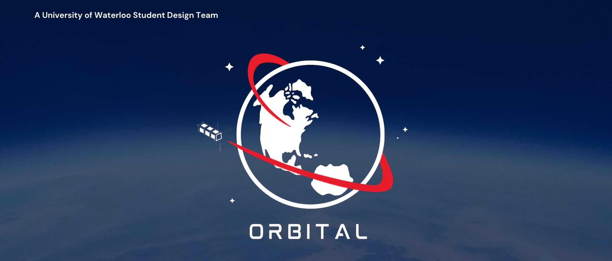

---
UW Orbital is a student design team at the University of Waterloo participating in the Canadian Satellite Design Challenge (CSDC) - a competition held every two years and involving a dozen universities from across Canada. Teams design a 3U CubeSat with unique missions and payloads and undergo launch readiness evaluations such as vibration testing. The winning team earns the opportunity to have its launch costs funded by the competition.
